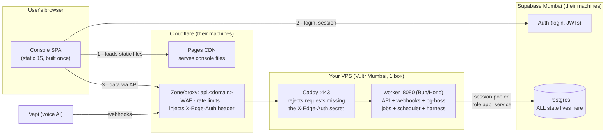

# Architecture — how the pieces actually talk to each other

Written to be **understood**, not just referenced. If you can redraw the first diagram from
memory and answer every row of the "when X is down" table, you understand your own system.
Companion docs: `tech-stack.md` (why each piece was chosen), `runbooks/vps-cloudflare-setup.md`
(how to build it), `security.md` (the controls), `secrets-map.md` (every variable, by name).

## 1 · The whole system on one screen

Three machines run your product. You own one of them.

The load-bearing idea: **the VPS is stateless**. Every row of data lives in Supabase. The VPS
only runs code, so you can destroy and rebuild it any time without losing anything — which is
also why "my VPS is a mystery" is a survivable condition: worst case, re-run
`runbooks/vps-cloudflare-setup.md` §2–§3 on a fresh box.

## 2 · Flow 1: a user opens the console

1. Browser fetches `https://<console>.pages.dev` (later `console.<domain>`). These are **static
   files on Cloudflare's CDN** — your VPS is not involved, at all. If the VPS is on fire, this
   step still works.
2. The SPA logs in against **Supabase Auth directly** using `VITE_SUPABASE_URL` +
   `VITE_SUPABASE_ANON_KEY`. The anon key is *designed* to be public (S7.3) — it grants nothing
   by itself; RLS decides what a logged-in user can see.
3. Data screens call the worker API at `VITE_API_URL` (`https://api.<domain>`). That request:
   crosses Cloudflare's edge (WAF + rate limits run here; a **Transform Rule adds the
   `X-Edge-Auth` header**) → hits the VPS on 443 → **Caddy** checks the header equals
   `EDGE_SHARED_SECRET` (else 403) and reverse-proxies to `worker:8080` → the worker checks the
   Supabase JWT, sets `request.org_id`, and queries Postgres **through the session pooler as
   `app_service`** — so RLS scopes every query to the caller's org.
4. The response walks the same path back. `CORS_ORIGINS` on the worker must list the console's
   origin or the *browser* discards the response even though the server answered — that's why
   "worker returns 200 in curl but console says unreachable" is almost always a CORS_ORIGINS or
   VITE_API_URL mismatch.

## 3 · Flow 2: a Vapi webhook arrives (the S6 doctrine, physically)

Vapi POSTs to `https://api.<domain>/webhooks/vapi/<orgId>` → Cloudflare (rate-limited path) →
Caddy → worker. The worker then does the drilled sequence: verify the `x-vapi-secret` signature
**on the raw body** → insert a `webhook_events` row keyed by `dedupe_key` (payload immutable;
status columns mutable) → **return 200 fast** → a pg-boss job (`webhook.process.vapi`) does the
real work later, inside the worker's job consumers. Vapi sends events out of order, so
processors upsert by `provider_ref` and order by `messages.seq`, never by arrival time.

Why the ceremony: webhooks are the one door the outside world can knock on without logging in.
Signature check keeps out forgeries, dedupe keeps out replays, fast-return keeps Vapi from
timing out and re-sending, and doing side effects in jobs means a crash mid-processing loses
nothing (the job retries; the event row is already stored).

## 4 · Flow 3: a deploy (three different mechanisms — know which is which)

| What | Trigger | Mechanism | State today |
|---|---|---|---|
| Console | push to `main` touching `apps/console/**` | Cloudflare's GitHub App builds in *their* builders → CDN. No GitHub Action, no secrets. | **LIVE**, automatic |
| DB migrations | push to `main` | `deploy.yml` `staging-migrations`: `supabase db push` to the staging project (append-only, idempotent) | **LIVE**, automatic |
| Worker | should be: push to `main` → build image → ship to VPS → health-gate | `deploy.yml` `staging-app`/`prod` are **`if: false` stubs** (tasks 14/14b) | **MANUAL**: ssh in, `docker compose up -d` |

The asymmetry in the last two rows is your single most important debt (§6.1): schema updates
itself on every merge, code doesn't. CI *builds* the worker image on every run — it just never
ships it.

## 5 · Networking glossary — the terms, as they exist in THIS repo

- **Reverse proxy (Caddy):** a front door that terminates TLS and forwards requests to the app
  behind it. The worker never faces the internet; in `docker-compose.yml` it has `expose:
  ["8080"]` (visible to other containers only) while Caddy has `ports: ["443:443"]` (visible to
  the world). One process to harden instead of every app.
- **The two-wall origin lockdown (S3.3):** wall 1 — the *provider's* cloud firewall allows 443
  only from Cloudflare's published IP ranges; wall 2 — even a request from a Cloudflare IP is
  403'd by Caddy unless it carries `X-Edge-Auth: <EDGE_SHARED_SECRET>`, which only *your zone's*
  Transform Rule injects (another Cloudflare customer can't fake it). Finding your VPS IP gains
  an attacker nothing.
- **TLS, twice:** browser↔Cloudflare uses Cloudflare's edge cert; Cloudflare↔VPS is "Full
  (strict)" against Caddy's auto-provisioned Let's Encrypt cert (TLS-ALPN challenge on 443 —
  that's why port 80 can stay firewalled shut).
- **Session pooler:** Supabase's connection front-end (`aws-1-ap-south-1.pooler...:5432`).
  Postgres connections are expensive; the pooler multiplexes many client connections onto few
  real ones. The worker connects through it as **`app_service`** — a deliberately weak role that
  RLS applies to — never `service_role` (hard rail 3).
- **Why Mumbai for everything:** worker↔DB round-trip is ~1–3ms when co-located in
  `ap-south-1`. A mid-call Vapi tool call has an 800ms p95 budget (T26.5); a US VPS would spend
  ~250ms of that on every single query's ocean crossing.
- **ufw / fail2ban / unattended-upgrades:** host firewall (deny all in; allow 443 + SSH from
  home IP only) / auto-bans IPs that brute-force SSH / auto-installs security patches. The
  boring Ubuntu hardening trio from runbook §2.
- **pg-boss:** the job queue — plain Postgres tables in the `pgboss` schema (no RLS there, by
  design), no Redis/extra infra. The same worker process that serves HTTP also consumes jobs.

## 6 · When X is down — what breaks, what survives, where to look

| Failure | What breaks | What survives | First place to look |
|---|---|---|---|
| Worker crashed / VPS down | All API screens (console shows its unreachable-API state, not a white screen), webhook processing (Vapi gets 52x from the edge and retries per its policy) | Console static shell, login (Supabase-direct) | `ssh deploy@<vps>` → `docker compose ps` / `docker compose logs worker \| tail` |
| Supabase down | Everything with data: login, worker (its DB queries), migrations | Static pages only | status.supabase.com — nothing on your side to fix |
| Cloudflare down | All ingress: console AND api (both ride Cloudflare) | The worker keeps running jobs already queued | cloudflarestatus.com |
| `EDGE_SHARED_SECRET` mismatch (rotated one side only) | Every API call → 403 | Everything else | Caddy logs; compare VPS `.env` vs the Transform Rule — rotate them **together** |
| `CORS_ORIGINS` wrong | Console API calls fail *in the browser only* (curl works!) | curl/Vapi traffic | Browser devtools console → CORS error naming the origin |
| DB password rotated, VPS `.env` stale | Worker can't connect → restart loop | Console static + auth | `docker compose logs worker`; update `~/app/.env`, `docker compose up -d` |
| Migrations ahead of worker code (see §4) | Endpoints touching changed schema 500 | Everything else | Did `main` merge a migration while the VPS still runs an old image? Deploy the worker |
| `VITE_*` build vars wrong/missing | Console renders ConfigErrorScreen naming the missing var (task 16 made this honest) | — | Cloudflare Pages → project → env vars, then redeploy |

## 7 · Technical-debt register (what will bite at scale, ranked)

1. **Worker deploy is manual while migrations auto-push** (tasks 14/14b, `if: false` in
   `deploy.yml`). Highest leverage fix in the repo: until it lands, every merge can silently
   open a schema/code gap, and every deploy is a hand-run with no health gate.
2. **Single VPS = single point of failure, and a compose restart IS downtime** (seconds, but
   real). Accepted deliberately at this stage. The honest ladder: automated health-gated deploy
   (14b) → `docker compose up -d --wait` rollback discipline → *only then* think about blue/green
   or a second box. Do not build zero-downtime infra before there are users to notice downtime.
3. **One process does everything** (API + webhooks + jobs + scheduler + harness). Fine now;
   the first real scale move is splitting job consumers from the HTTP server — the code layout
   (`services/worker/src/`) already separates them, so it's a deploy split, not a rewrite.
4. **`orchestrator/` is gitignored** — the multi-agent procedure STATE.md references
   (`/goal`, HANDOFF, flip-kit) lives only on the laptop. A disk failure loses it. Either commit
   it or accept it as disposable.
5. **`apps/www` is a README-only placeholder** wired into Pages/Dockerfile assumptions; a
   `--filter www build` fails today. Harmless until someone arms it.
6. **Env-contract drift** (details in `secrets-map.md` §4): `VAPI_WEBHOOK_SECRET` is read at
   request-time (`vapi/receive.ts:27`), bypassing the boot-time Zod gate in `env.ts` — a VPS
   `.env` missing it boots "healthy" and fails only when the first webhook arrives.
7. **Infra identity is hardcoded** (VPS IP, project ref, pooler host in
   `scripts/provision-staging.sh` / `deploy.yml`). Not secrets, but re-provisioning means
   editing scripts. Fine at one environment; parameterize when prod exists.
